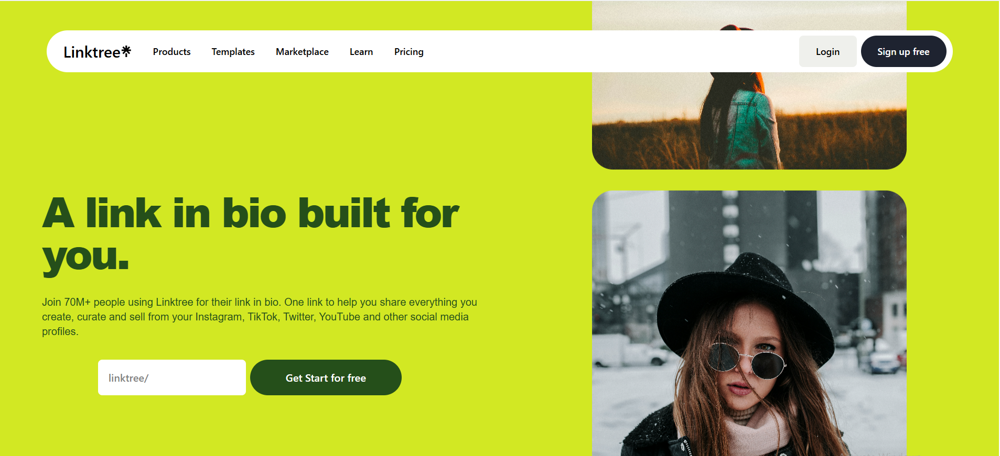
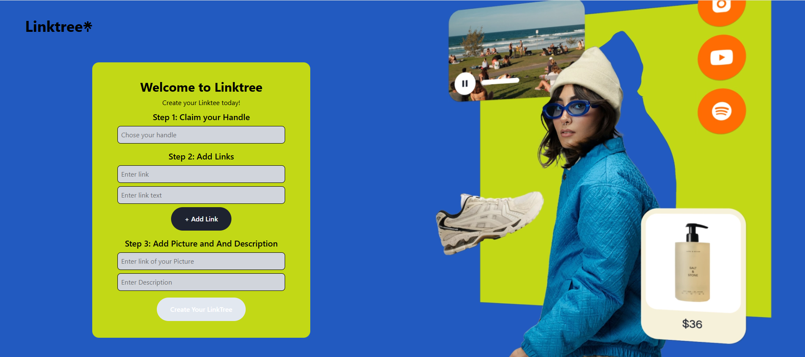
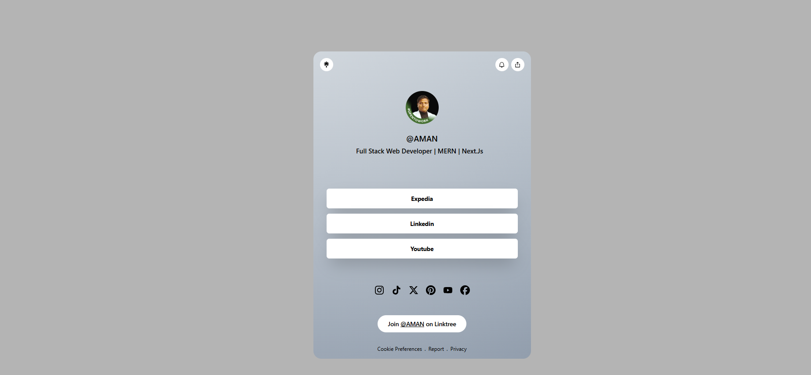

# 🌳 Linktree Clone – Full Stack Project

> A modern **Link-in-Bio platform** inspired by Linktree, built using **Next.js (App Router)**, **MongoDB**, and **Tailwind CSS**.  
Create one beautiful link to share everything you do — social profiles, websites, videos, and more.

---

## 🚀 Live Demo
🔗 *Coming soon (Vercel deployment)*

---

## 🖼️ Screenshots

### 🏠 Landing Page
Clean and bold landing page inspired by Linktree’s official design.

---

### ✨ Create Your Linktree
Step-by-step interface to claim your handle, add links, images, and descriptions.

---

### 👤 Public Profile Page
A shareable public Linktree profile with clickable links and social icons.

---

## 🌟 Features

✅ Claim a **unique Linktree handle**  
✅ Add unlimited links (Instagram, YouTube, LinkedIn, etc.)  
✅ Public shareable profile page  
✅ Responsive & mobile-friendly UI  
✅ Modern Linktree-style design  
✅ MongoDB database integration  
✅ API routes using Next.js App Router  
✅ Server-side validation  

---

## 🛠️ Tech Stack

### Frontend
- ⚛️ **Next.js (App Router)**
- 🎨 **Tailwind CSS**
- 🧩 **React**

### Backend
- 🗄️ **MongoDB (Native Driver)**
- 🌐 **Next.js API Routes**

### Tools & Platforms
- 🧪 Postman
- 🧭 MongoDB Compass
- 🧑‍💻 Git & GitHub

---

### ⚙️ Environment Setup

Create a .env.local file in the root directory:

MONGODB_URI=your_mongodb_connection_string
---
### ▶️ Run the Project Locally

npm install

Open in browser:http://localhost:3000

## 🧠 Key Learnings

Next.js App Router API routes

MongoDB connection handling without Mongoose

Avoiding Edge runtime for databases

Handling modern Next.js + Turbopack issues

Tailwind CSS advanced layouts

Server-side validation and error handling

---
## 🚧 Future Improvements

### 🔐 Authentication (Login / Signup)
### 🎨 Theme customization
### 📊 Analytics dashboard
### 🧲 Drag & drop link ordering
###  🌙 Dark mode
### 📱 QR Code for profile

 --- 
 ---

# 👨‍💻 Author

## Aman Singh Sikarwar
### Full Stack Web Developer (MERN | Next.js)
📌 GitHub: https://www.github/aman0208ss

📌 LinkedIn: https://www.linkedin.com/in/aman-singh-sikarwar-02/
